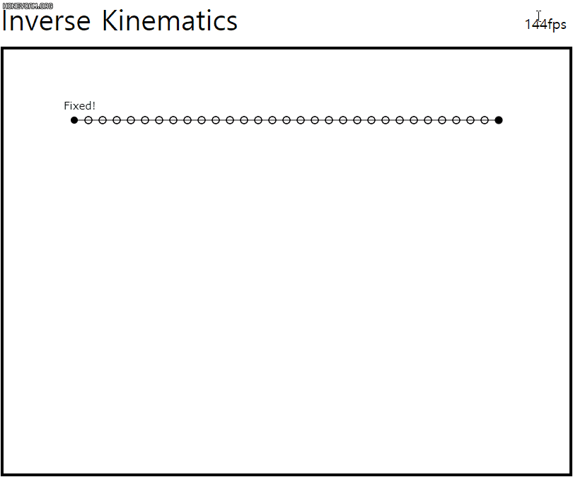

# Inverse Kinematics

A simple implementation of [FABRIK inverse kinematics](https://en.wikipedia.org/wiki/Inverse_kinematics#Heuristic_Methods).  

Video: https://youtu.be/z7_WF7l2JgI  
Live Demo: https://sopiro.github.io/inverse_kinematics  

## Preview

## +
This method also can be applied to hierarchical joints.  
After the calculation of each joint positions, You can re-calculate the joint transforms from tip to root.  
